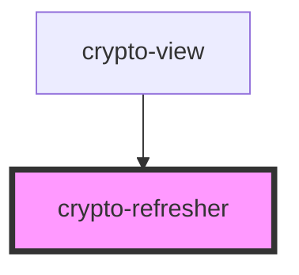

# crypto-refresher

<!-- Auto Generated Below -->

## Events

| Event               | Description | Type               |
| ------------------- | ----------- | ------------------ |
| `refreshCryptoData` |             | `CustomEvent<any>` |

## Dependencies

### Used by

 - [crypto-view](../crypto-view)

### Graph

----------------------------------------------

*Built with [StencilJS](https://stenciljs.com/)*
