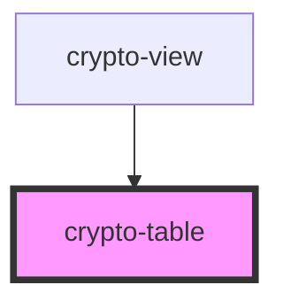

# crypto-table

<!-- Auto Generated Below -->

## Properties

| Property           | Attribute | Description | Type              | Default     |
| ------------------ | --------- | ----------- | ----------------- | ----------- |
| `cryptoCurrencies` | --        |             | `string[]`        | `undefined` |
| `cryptoData`       | --        |             | `CryptoInterface` | `undefined` |

## Dependencies

### Used by

 - [crypto-view](../crypto-view)

### Graph

----------------------------------------------

*Built with [StencilJS](https://stenciljs.com/)*
