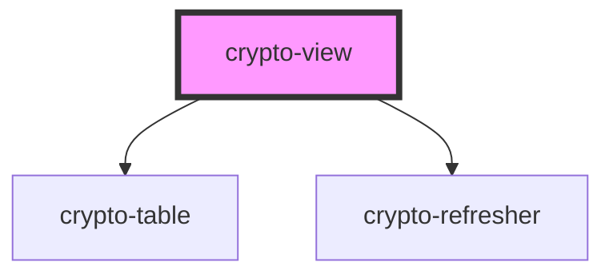

# crypto-view

<!-- Auto Generated Below -->

## Properties

| Property | Attribute | Description                                   | Type     | Default     |
| -------- | --------- | --------------------------------------------- | -------- | ----------- |
| `apikey` | `apikey`  | Valid API key obtained from cryptocompare.com | `string` | `undefined` |

## Methods

### `refreshCryptoData() => Promise<void>`

#### Returns

Type: `Promise<void>`

## Dependencies

### Depends on

- [crypto-table](../crypto-table)
- [crypto-refresher](../crypto-refresher)

### Graph

----------------------------------------------

*Built with [StencilJS](https://stenciljs.com/)*
